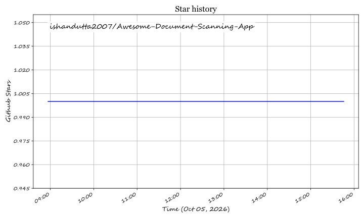

  

  
  
  
  
  
  

# 🚀 Awesome Document Scanning Apps 📄📱

**Curated List of SaaS Products & Open-Source GitHub Projects for Document Scanning, Mobile OCR, Edge Detection, & PDF Digitization**

> *Discover top-rated commercial scanners, privacy-first mobile apps, self-hosted document management platforms, and developer SDKs with offline OCR capabilities.*

---

## 📖 Table of Contents
- [📊 Market Overview](#-market-overview)
- [☁️ Commercial SaaS Platforms & Apps](#️-commercial-saas-platforms--apps)
- [🔓 Open-Source GitHub Projects](#-open-source-github-projects)
- [🔍 Key Features Comparison](#-key-features-comparison)
- [🤝 How to Contribute](#-how-to-contribute)
- [⚠️ Disclaimer](#-disclaimer)
- [💖 Support & Contributions](#-support--contributions)
- [📈 Star History](#-star-history)

---

## 📊 Market Overview

The global document scanning app market is estimated at **~$3.5B in 2026** and is projected to reach **~$9B by 2032**. The sector is **moderately fragmented** — tech giants like **Microsoft** and **Adobe** leverage ecosystem bundling for mass consumer reach, while specialized vendors like **CamScanner**, **Genius Scan**, and **Scanbot SDK** compete on advanced mobile capture features, enterprise integrations, and privacy-first local processing.

---

## ☁️ Commercial SaaS Platforms & Apps

> **📊 Market Insight**: Pricing models vary significantly across the industry. Consumer apps offer freemium tiers with ad banners or storage quotas, whereas enterprise SDKs provide flat annual licensing.

| 📱 App / Platform | 📝 Description | 🏢 Company Valuation / Revenue (Est.) | 💳 Pricing (Starting Tier) | 🎁 Free Tier Limits |
| :--- | :--- | :--- | :--- | :--- |
| **[Microsoft Lens](https://www.microsoft.com/en-us/p/office-lens/9wzdncrfj3t8)** | Digitizes documents, whiteboards, business cards, and receipts. OCR text recognition in 21 languages; direct export to PDF, Word, Excel, and OneNote. | **~$281B Annual Revenue (FY2025)** | **Free** (bundled with Microsoft 365) | **Free with Quotas**: ~6 OneDrive uploads per session before quota limits; basic OCR limits apply. |
| **[Adobe Scan](https://www.adobe.com/mobile-apps/adobe-scan.html)** | Mobile document scanner with automatic edge capture, OCR text extraction, form filling, cloud backup, and PDF editing. | **~$21.5B Annual Revenue (FY2025)** | **$4.99/month** (AI Assistant Add-On) | **Free Forever**: 5 GB Adobe cloud storage, unlimited basic document scanning & OCR. AI requests throttled after complimentary trial. |
| **[CamScanner](https://www.camscanner.com/)** | Global leader in mobile scanning with optical character recognition, PDF annotation, watermark removal, and cloud sync. | **~$500M+ Valuation / ~$100M ARR (INTSIG)** | **$9.99/month** (Premium Subscription) | **Free Forever**: Basic document scanning with watermark on exported PDFs & ad banners. |
| **[ABBYY FineReader PDF](https://www.abbyy.com/finereader-pdf/)** | Industrial-grade PDF software and mobile scanner featuring industry-leading multilingual OCR text recognition engine. | **~$250M Annual Revenue (ABBYY)** | **$99.00/year** (Standard Desktop/Mobile Plan) | **7-Day Free Trial**: Corporate trial includes 100 total pages of automated OCR processing. |
| **[SwiftScan](https://swiftscan.app/)** | High-performance mobile scanner app with auto-capture, cloud integration, OCR, smart file naming, and document workflows. | **~$50M Valuation (Maple Media)** | **$4.99/month** (SwiftScan VIP Pro) | **Free Forever**: Single-page document scanning with basic edge detection. Advanced OCR and cloud backup require Pro. |
| **[Scanbot SDK](https://scanbot.io/)** | Enterprise-grade B2B mobile scanner SDK providing instant document capture, edge detection, and barcode scanning for mobile apps. | **~$15M ARR (Scanbot SDK GmbH)** | **~$1,200/year** (Commercial License Starting Tier) | **No Free Plan**: 30-day developer evaluation license with unlimited scans for testing; commercial license required for production. |
| **[Genius Scan](https://www.thegrizzlylabs.com/genius-scan/)** | Privacy-focused mobile document scanner with smart edge detection, perspective correction, color enhancement, and offline processing. | **~$5M ARR (The Grizzly Labs)** | **$7.99 one-time purchase** (Genius Scan+ iOS) / **$2.99/month** (Genius Cloud) | **Free Forever**: Unlimited page scanning, zero watermarks, 100% offline processing. OCR & cloud backup require paid upgrade. |
| **[Notebloc Scanner](https://www.notebloc.com/)** | Smart document scanning app tailored for students and educators with grid removal, clean contrast filters, and PDF export. | **~$2M Annual Revenue (Notebloc World)** | **$2.99 one-time purchase** (Ad-Free Edition) | **Free Forever**: Full document scanning & PDF export supported by ad banners. |
| **[TurboScan](https://www.turboscan.com/)** | Ultra-fast multi-page scanner app with SureScan 3x mode for sharp document captures, passcodes, and email sharing. | **~$1M Annual Revenue (Piksoft Inc.)** | **$9.99 one-time purchase** (TurboScan Unlimited) | **Free Trial Version**: TurboScan Free permits scanning up to 3 multi-page documents; unlimited scanning requires paid upgrade. |

---

## 🔓 Open-Source GitHub Projects

> **🔒 Privacy First**: Open-source mobile scanners keep document processing 100% local on your device using computer vision and offline OCR engines.

| 📦 Project / Repository | 📄 Description | 🏷️ License | ⭐ GitHub_Stars |
| :--- | :--- | :--- | :--- |
| **[OpenCV](https://github.com/opencv/opencv)** | Open Source Computer Vision Library powering real-time edge detection, perspective correction, and image filtering in mobile scanning apps. | Apache 2.0 |  |
| **[PaddleOCR](https://github.com/PaddlePaddle/PaddleOCR)** | High-accuracy multilingual OCR toolkits based on PaddlePaddle, supporting document recognition, layout analysis, and text extraction. | Apache 2.0 |  |
| **[Tesseract OCR](https://github.com/tesseract-ocr/tesseract)** | The premier open-source OCR engine supporting 100+ languages, widely embedded into privacy-first mobile scanning applications. | Apache 2.0 |  |
| **[Paperless-ngx](https://github.com/paperless-ngx/paperless-ngx)** | Community-driven self-hosted document management system that indexes, OCR-processes, and organizes scanned physical documents. | GPL-3.0 |  |
| **[OSS Document Scanner](https://github.com/ossappscollective/OSS-DocumentScanner)** | Full-featured cross-platform (Android/iOS) privacy-first mobile scanner with offline Tesseract OCR, auto edge detection, and cloud sync. | GPL-3.0 |  |
| **[OpenScan](https://github.com/ethereal-developers/OpenScan)** | Open-source Android document scanner built with zero tracking, no ads, auto crop, perspective transformation, and PDF creation. | GPL-3.0 |  |
| **[OpenScanner](https://github.com/pencilresearch/OpenScanner)** | Fast, reliable open-source document scanner app for iOS written in Swift with native camera framework integration. | MIT |  |
| **[FairScan](https://github.com/pynicolas/FairScan)** | Minimalist Android scanner focusing on privacy, offline searchable PDF creation, and zero external analytics. | GPL-3.0 |  |
| **[React Native Document Scanner](https://github.com/Michaelvilleneuve/react-native-document-scanner)** | Document scanner component for React Native apps featuring live border detection, rectangle matching, and image filters. | MIT |  |
| **[Python OpenCV Document Scanner](https://github.com/vipul-sharma20/document-scanner)** | OpenCV-based document scanner script written in Python for automatic document edge detection and perspective alignment. | MIT |  |
| **[Interactive OpenCV Scanner](https://github.com/andrewdcampbell/OpenCV-Document-Scanner)** | Interactive Python document scanning framework featuring adaptive thresholding, corner detection, and image sharpening. | MIT |  |
| **[AndroidDocumentScanner](https://github.com/mayuce/AndroidDocumentScanner)** | Android library providing CamScanner-like functionality with perspective warping and image cleanup filters. | Apache 2.0 |  |
| **[MakeACopy](https://github.com/egdels/makeacopy)** | German privacy-first Android scanner with OpenCV edge detection, PaddleOCR/Tesseract offline OCR, and F-Droid reproducible builds. | Apache 2.0 |  |
| **[RN Document Scanner Plugin](https://github.com/WebsiteBeaver/react-native-document-scanner-plugin)** | Native React Native plugin wrapping Android ML Kit and iOS VisionKit document scanning APIs. | MIT |  |
| **[Document-Scanner Android](https://github.com/Aniruddha-Tapas/Document-Scanner)** | Android document scanner app with custom camera view, crop handles, grayscale conversion, and PDF export. | MIT |  |

---

## 🔍 Key Features Comparison

- 📸 **Automatic Edge Detection**: Detects paper edges in real-time using OpenCV contour algorithms or machine learning (Apple VisionKit / Google ML Kit).
- 📐 **Perspective Correction**: Transforms angled camera shots into flat, rectangular document pages.
- 🔤 **Optical Character Recognition (OCR)**: Converts page images into searchable text using on-device engines (Tesseract / PaddleOCR) or cloud AI APIs.
- 📁 **Searchable PDF Export**: Embeds extracted text layers directly behind document images for seamless PDF searching.
- 🔐 **Privacy Protection**: 100% offline tools ensure zero telemetry, tracking, or cloud document leakage.

---

## 🤝 How to Contribute

Contributions are welcome! Please follow these guidelines:

1. 🍴 **Fork** this repository.
2. 📝 **Add/Update** your entry in `README.md` adhering to the table layout and sorting criteria.
3. 🔗 Include accurate project URLs, explicit starting tier pricing, clear free tier limits, and stargazer links.
4. 🚀 Open a **Pull Request** with a descriptive summary of your changes.

Check out the main collection list at [Awesome-Awesome-Awesome](https://github.com/ishandutta2007/Awesome-Awesome-Awesome).

---

## ⚠️ Disclaimer

- This list is **community-curated** for informational and educational purposes.
- Document scanning apps process sensitive documents (ID cards, financial receipts, legal contracts). Always review privacy policies and offline modes before scanning confidential data.
- Open-source solutions (**OSS Document Scanner**, **OpenScan**, **MakeACopy**, **FairScan**) offer 100% local processing and data ownership.

---

## 💖 Support & Contributions

If you find this repository helpful, please consider giving it a ⭐ **Star**, **Forking** it, or sharing it with your network!

Contributions are always welcome — feel free to submit a Pull Request to add new document scanning platforms or tools.

---

## 📈 Star History

## ⭐ Star History

<a href="https://star-history.com/#ishandutta2007/Awesome-Document-Scanning-App&Timeline" align="center">
  <picture>
    <source media="(prefers-color-scheme: dark)" srcset="assets/ishandutta2007_Awesome-Document-Scanning-App_growth.svg">
    
  </picture>
</a>
